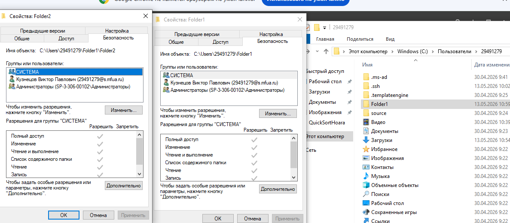
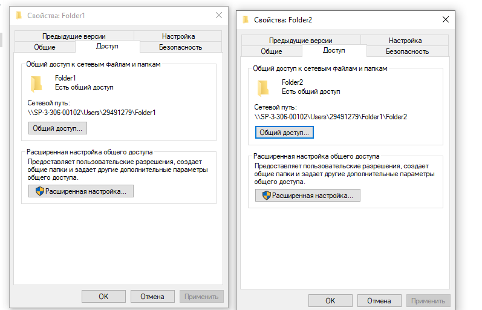
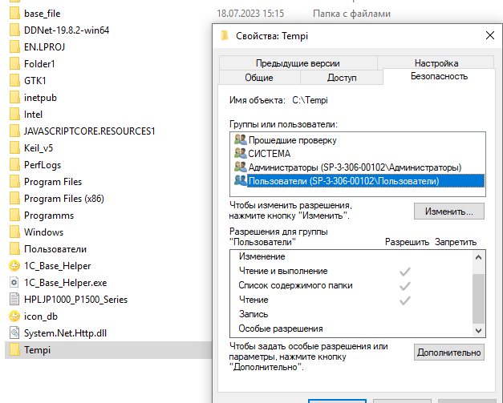

# Лабораторная работа №3. Управление разрешениями файловой системы NTFS

## Цель работы
Изучение механизмов назначения разрешений NTFS, наследования прав, а также поведения разрешений при копировании и перемещении объектов.

---

## Выполнение работы

### 1. Создание папок и настройка совместного доступа
Были созданы каталоги `Folder1` и `Folder2`. 

Для папки `Folder1` настроены особые права доступа в соответствии с четырьмя критериями. Пользователь `uir-2` заменен на `29491279`.

#### Изменение разрешений для соответствия критериям:
1. **Чтение файлов всеми (Критерий 1):** Группе «Пользователи» (или «Все») назначены права **«Чтение и выполнение»**, **«Список содержимого папки»**, **«Чтение»**.
2. **Создание файлов всеми (Критерий 2):** Группе «Пользователи» добавлено разрешение **«Запись»** (Создание файлов / запись данных, Создание папок / добавление данных).
3. **Управление своими файлами (Критерий 3):** Специальному субъекту **«Создатель-владелец»** (Creator Owner) задано разрешение **«Изменение»** или **«Полный доступ»** с применением *«Только для подпапок и файлов»*. Это позволяет пользователям модифицировать и менять разрешения только на созданные ими объекты.
4. **Ответственность пользователя 29491279 (Критерий 4):** Пользователю `29491279` явно назначен **«Полный доступ»** (или «Изменение» + «Удаление») на папку `Folder1`, её подпапки и файлы.

---

### 2. Работа с корневым каталогом диска C:\

#### Создание папки Temp1 (под учетной записью uir-3)
В корне диска `C:\` создана папка `Temp1`.
*   **Установленные разрешения:** Автоматически унаследованы от корня `C:\`. Обычно это: «Администраторы» — Полный доступ, «Система» — Полный доступ, «Пользователи» — Чтение и выполнение, Создание папок/файлов (в зависимости от настроек ОС).
*   **Владелец папки:** `uir-3` (учетная запись, создавшая объект).

#### Создание папок Temp2 и Temp3 (под учетной записью администратора uir)
В корне диска `C:\` созданы папки `Temp2` и `Temp3`.
*   **Установленные разрешения:** Идентичны разрешениям родительского тома `C:\` (унаследованы).
*   **Владелец папок:** Группа `Администраторы` (в Windows при создании объекта членом группы администраторов владельцем часто становится вся группа, а не отдельный пользователь) либо лично `uir`.

---

### 3. Снятие наследования и явная настройка прав
Для папок отключено наследование («Снять флажок Наследовать...») с удалением всех сторонних разрешений.

#### Папка Temp2
*   `Администраторы` — Полный доступ
*   `Пользователи` — Чтение и выполнение

#### Папка Temp3
*   `Администраторы` — Полный доступ
*   `Операторы архива` — Чтение и выполнение
*   `Пользователи` — Полный доступ

---

### 4. Копирование и перемещение объектов на одном томе NTFS

#### Копирование C:\Temp2 в C:\Temp1 (под uir)
Папка скопирована с зажатым `CTRL`. Проведен анализ объекта `C:\Temp1\Temp2`:
*   **Разрешения:** Папка **потеряла** свои оригинальные разрешения и **унаследовала** права от новой родительской папки `C:\Temp1`.
*   **Владелец:** Владельцем стал пользователь `uir`, выполнивший копирование (создавший новую копию объекта).
*   **Сравнение:** Оригинальная `C:\Temp2` сохранила свои явные права, а копия `C:\Temp1\Temp2` адаптировалась под права целевого каталога.

#### Перемещение C:\Temp3 в C:\Temp1 (под uir-3)
Папка `C:\Temp3` перемещена в `C:\Temp1`.
*   **Разрешения:** При перемещении в пределах одного и того же NTFS-тома объект **сохраняет** свои исходные разрешения (явные права `Администраторы`, `Операторы архива`, `Пользователи` остались неизменными). Наследование от `C:\Temp1` не произошло.
*   **Владелец:** Владелец **не изменился** (остался прежним, несмотря на то, что перемещение выполнял `uir-3`).

---

## Вывод
1. При **копировании** файлов/папок на одном NTFS-томе они создаются заново. Они теряют старые права, наследуют разрешения целевой папки, а текущий пользователь становится владельцем.
2. При **перемещении** файлов/папок в пределах одного NTFS-тома обновляются только указатели в таблице MFT. Объект полностью сохраняет свои права доступа и прежнего владельца.
