# Лабораторная работа: Управление процессами в Linux

## Цель работы

Изучение жизненного цикла процессов в операционной системе Linux, освоение практических навыков управления режимами их выполнения, мониторинга системных ресурсов и способов корректного завершения задач.

### Задачи работы:
1. Научиться запускать процессы в активном (`foreground`) и фоновом (`background`) режимах, а также перемещать задачи между ними.
2. Освоить методы сохранения работоспособности программ после закрытия терминала или выхода пользователя из системы (`nohup`, `screen`).
3. Изучить инструменты статического и динамического мониторинга процессов (`ps`, `pstree`, `top`), а также методы их поиска в системе (`pgrep`).
4. Научиться анализировать общую утилизацию аппаратных ресурсов компьютера: оперативную память (`free`) и среднюю нагрузку на процессор (`uptime`).
5. Освоить механизмы отправки сигналов завершения процессам с использованием утилит `kill` и `pkill`.


## 1. Запуск задач в активном и фоновом режиме (Foreground и Background)

* **Foreground (активный режим)** — процесс занимает терминал, блокируя ввод.
* **Background (фоновый режим)** — процесс работает параллельно, терминал свободен.

### Управление режимами:
* **Запуск в фоне**: после добавления & в команду терминал теперь не блокируется и процесс выполняется в фоновом режиме
  ```bash
  sleep 100 &
  ```


* **Приостановка процесса**: нажмите `Ctrl + Z` (переводит активный процесс в статус `stopped`).

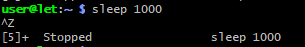
* **Просмотр фоновых задач**: команда `jobs`.

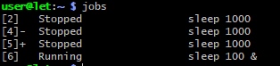
* **Перевод в фон (`bg`)**: возобновляет остановленный процесс в фоновом режиме.
  ```bash
  bg %2
  ```

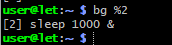
* **Перевод в активный режим (`fg`)**: возвращает фоновый процесс на передний план.
  ```bash
  fg %1
  ```

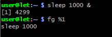
---

## 2. Запуск процессов после выхода из системы (Управление сессиями)

При закрытии терминала процессам посылается сигнал `SIGHUP` (завершение). Способы обойти это:

### Утилита `nohup` (No Hang Up)
Игнорирует сигнал закрытия терминала. Вывод автоматически перенаправляется в файл `nohup.out`.
```bash
nohup ping google.com &
```
---


## 3. Отслеживание и сортировка активных процессов

### Команда `ps` (Статический снимок процессов)
* `ps aux` — показывает процессы всех пользователей с подробностями.

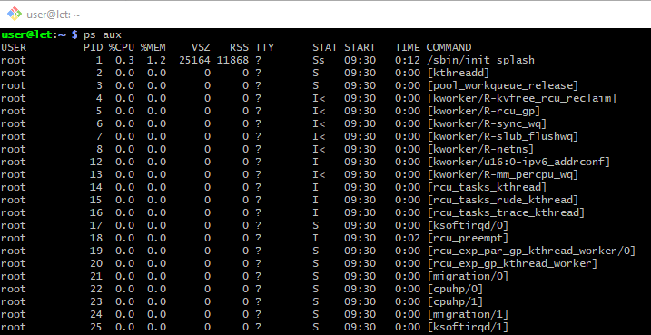

* `ps -ef` — стандартный синтаксис для отображения всех процессов.

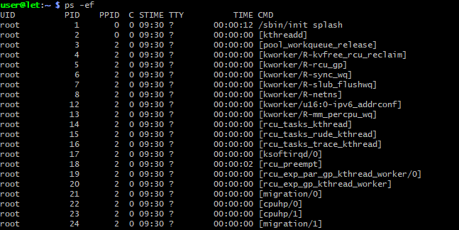

### Команда `pstree` (Дерево процессов)
Показывает иерархию (родительские и дочерние процессы).
```bash
pstree -p
```
*(Флаг `-p` выводит PID процессов).*

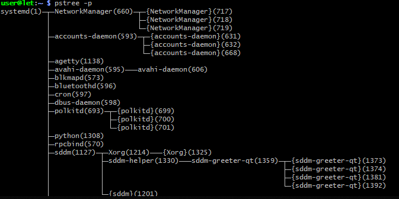

### Команда `top` (Динамический диспетчер задач)

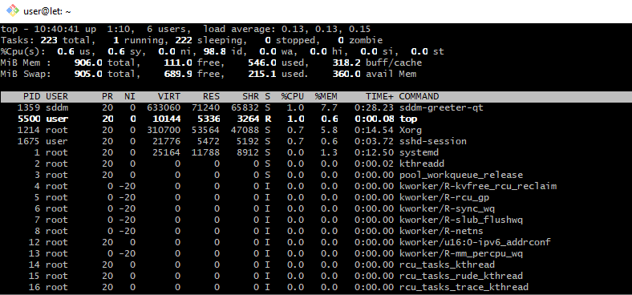

Отображает процессы в реальном времени.
* **Сортировка по CPU**: нажмите `P`.

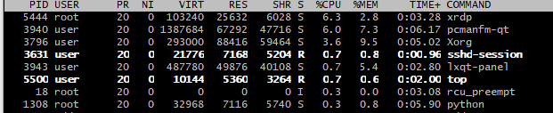

* **Сортировка по памяти**: нажмите `M`.

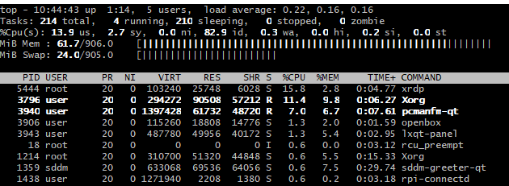

* **Выход**: нажмите `q`.

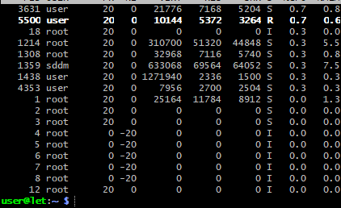

### Поиск процессов: `pgrep`
Находит PID (идентификатор) процесса по его имени.
```bash
pgrep -l python
```

---

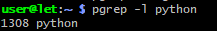

## 4. Мониторинг ресурсов системы

### Команда `free` (Оперативная память)
Показывает объем занятой и свободной памяти RAM и Swap.
```bash
free -h
```
*(Флаг `-h` выводит данные в удобном для чтения виде: Мб, Гб).*

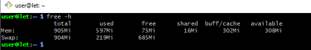

### Команда `uptime` (Время работы и нагрузка)
Показывает текущее время, время аптайма, количество пользователей и `Load Average` (среднюю нагрузку за 1, 5 и 15 минут).
```bash
uptime
```

---

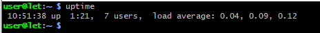

## 5. Завершение процессов

Уничтожение процессов происходит путем отправки им сигналов (например, `SIGTERM` или `SIGKILL`).

### Команда `kill`
Завершает процесс по его `PID`.
```bash
kill 1234
```
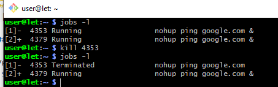

*Если процесс не реагирует (принудительное завершение):*
```bash
kill -9 1234
```

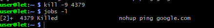
### Команда `killall`
Завершает сразу группу процессов

```bash
killall sleep
```
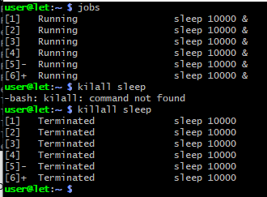

### Команда `pkill`
Завершает процессы по их **имени**, а не по PID.
```bash
pkill -9 ping
```

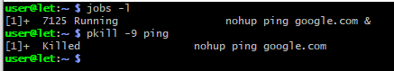

## Вывод

В ходе выполнения лабораторной работы были освоены практические навыки управления процессами и мониторинга системных ресурсов в операционной системе Linux (на примере дистрибутива Debian). 

### Основные результаты работы:
1. **Управление режимами выполнения**: Освоены механизмы перевода задач между активным (`foreground`) и фоновым (`background`) режимами с помощью утилит `bg`, `fg`, а также диспетчеризация фонового пространства через команду `jobs`.
2. **Обеспечение отказоустойчивости сессий**: Изучены способы защиты процессов от сигнала закрытия терминала `SIGHUP` с помощью утилиты `nohup` и полноценного менеджера терминалов `screen`, что критически важно для выполнения длительных фоновых задач на серверах.
3. **Мониторинг и инспекция системы**: Применены инструменты статического (`ps`, `pstree`, `pgrep`) и динамического (`top`) анализа запущенных процессов. Освоены методы оценки загрузки оперативной памяти (`free`) и общего состояния сервера (`uptime`).
4. **Контроль и завершение процессов**: Получены практические навыки отправки системных сигналов завершения (включая `SIGTERM` и `SIGKILL`) с использованием утилит `kill` (по PID или Job ID через синтаксис `%`) и `pkill` (по имени процесса).

### Заключение:
Приобретенные навыки администрирования процессов являются базовым фундаментом для управления серверными операционными системами, оптимизации распределения вычислительных ресурсов и автоматизации фоновых задач в среде Linux.
