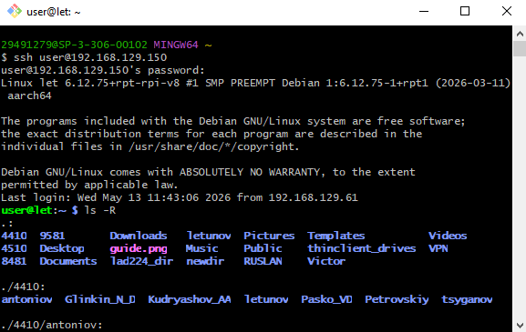
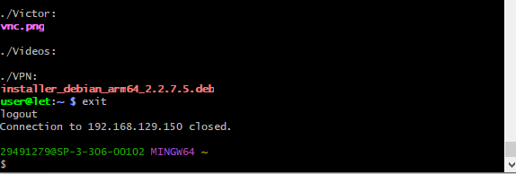
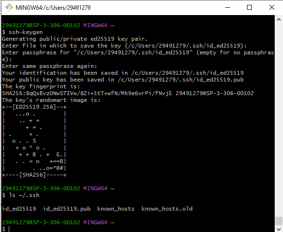
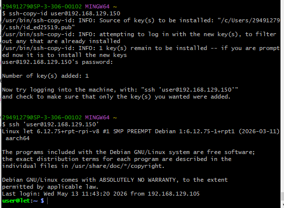

# Лабораторная работа по SSH

## Цель работы
Изучение протокола SSH, настройка удаленного подключения к плате Raspberry Pi, создание структуры каталогов и автоматизация аутентификации с помощью SSH-ключей.

---

## Выполнение работы

### 1. Подключение к Raspberry Pi и создание структуры каталогов
Для подключения к удаленному компьютеру по протоколу SSH выполняется команда:

```bash
ssh user@192.168.129.150
```

После ввода пароля (`123`) предоставляется доступ к консоли Raspberry Pi. В корневом каталоге находится папка с номером группы. Внутри неё создан каталог с именем и фамилией студента, а также выполнено задание по созданию требуемых файлов и подкаталогов.

Проверка успешного создания структуры объектов выполнена с помощью команды рекурсивного вывода:

```bash
ls -R
```



Для завершения сессии и отключения от SSH используется команда:

```bash
exit
```



---

### 2. Генерация SSH-ключей
Для создания пары ключей на локальном компьютере используется встроенная утилита:

```bash
ssh-keygen
```

*   **Путь сохранения:** По умолчанию файлы сохраняются в директорию `~/.ssh/`. Для подтверждения нажата клавиша `Enter`.
*   **Парольная фраза (Passphrase):** Поле оставлено пустым (нажат `Enter`) для обеспечения автоматического входа без дополнительного ввода пароля.

После завершения генерации папка `.ssh` проверена командой:

```bash
ls ~/.ssh
```

В каталоге созданы два файла:
*   `id_rsa.pub` — публичный (открытый) ключ. Копируется на удаленное устройство.
*   `id_rsa` — приватный (закрытый) ключ. Хранится строго на локальном ПК в секрете.



---

### 3. Копирование ключа на Raspberry Pi
Чтобы использовать сгенерированные ключи для авторизации, необходимо добавить публичный ключ в файл `~/.ssh/authorized_keys` на целевой плате. Для автоматизации этого процесса применена команда:

```bash
ssh-copy-id user@192.168.129.150
```

*Примечание: в аргументах команды указываются актуальное имя пользователя и IP-адрес платы (например, `user@192.168.129.150`).*

Итогом выполнения операции является возможность последующего беспарольного подключения к Raspberry Pi:

```bash
ssh user@192.168.129.150
```



---

## Вывод
В ходе лабораторной работы были освоены базовые команды SSH для удаленного администрирования Raspberry Pi. Настроена безопасная и удобная аутентификация по ключам, исключающая необходимость ручного ввода пароля при каждом подключении.
