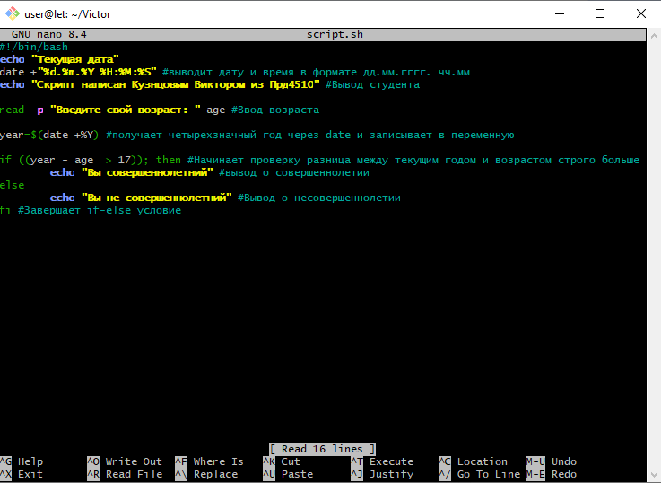
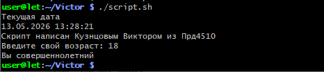

# Лабораторная работа. Создание и запуск Bash-скрипта

## Цель работы
Изучение основ программирования на языке Bash, работа с системными командами вывода даты, интерактивный ввод данных и использование условных операторов.

---

## Выполнение работы

### 1. Создание файла скрипта
В рабочей директории был создан файл скрипта с расширением `.sh` с помощью текстового редактора. Скрипту были выданы права на исполнение командой `chmod +x`.

### 2. Исходный код скрипта
Скрипт выполняет следующие функции:
1. Выводит на экран текущую дату и время в человекочитаемом формате.
2. Выводит сообщение с фамилией студента и номером группы.
3. Запрашивает у пользователя год рождения, вычисляет возраст на основе текущего системного года и выводит вердикт о совершеннолетии.



### 3. Запуск и проверка работы
Запуск скрипта осуществлен из текущей директории с помощью команды:
```bash
./script.sh
```

В ходе выполнения скрипт корректно отобразил дату, вывел информацию об авторе, успешно обработал введенный год рождения и выполнил логическую проверку условия.



---

## Вывод
В ходе лабораторной работы был успешно создан и протестирован Bash-скрипт. Освоены навыки работы с переменными, утилитой `date` и ветвлением `if-else` в операционных системах семейства Linux.
